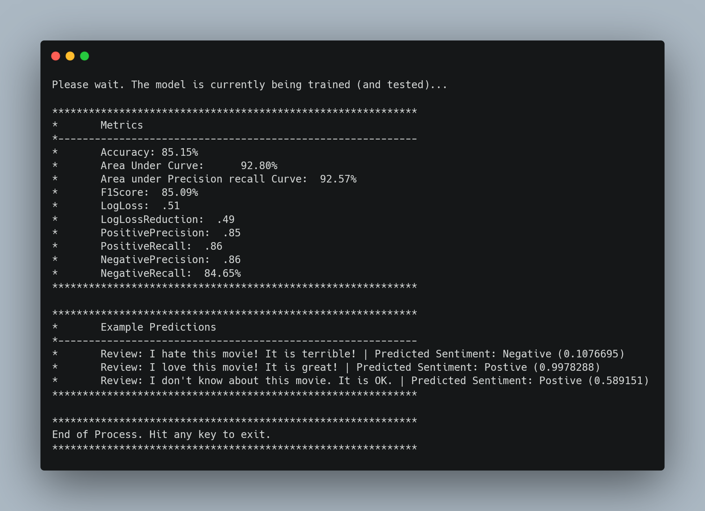

# Sentiment Analysis for Movie Reviews

This repository demonstrates [ML.NET](https://www.microsoft.com/net/learn/apps/machine-learning-and-ai/ml-dotnet) being applied to a **binary classification** problem: predicting the sentiment (positive or negative) of movie reviews.

| ML.NET version | API type          | App Type    | Data type | Scenario            | ML Task                   | Algorithm                  |
|----------------|-------------------|-------------|-----------|---------------------|---------------------------|-----------------------------|
| v1.5.2         | Dynamic API       | Console app | CSV       | Sentiment Analysis  | Two-class  classification | Stochastic dual coordinate ascent |

## To Get Started

1) Get the data! It's available on kaggle here: [imdb-dataset-of-50k-movie-reviews](https://www.kaggle.com/lakshmi25npathi/imdb-dataset-of-50k-movie-reviews) (and used and described in [this paper](https://scholar.google.com/scholar?hl=en&as_sdt=0%2C5&q=Learning+Word+Vectors+for+Sentiment+Analysis&btnG=).)

2) Create a *Data* inside the first MoveReviewSentiment folder and put the CSV file inside it.

3) Change the name of the CSV file to: *imdbdataset.csv* (or change the code so that it works with the original file name). At this point, your repository should look something like this:

```
MovieReviewSentiment
└───Data
│     imdbdataset.csv
│ 
└───MovieReviewSentiment
      Program.cs
      Helper.cs
      ...
```

4) Open up the solution and run the project! When the program has finished running, you should see something like this:


